<picture>
  <source media="(prefers-color-scheme: dark)" srcset="assets/dark.svg">
  <source media="(prefers-color-scheme: light)" srcset="assets/light.svg">
  
</picture>

 

 

---

# About Me

Software Engineer and Computer Science undergraduate focused on building scalable products, intelligent systems, and security-driven applications.

My engineering philosophy revolves around creating impactful software that combines strong system design, modern development practices, artificial intelligence, and real-world usability.

I actively work across Full Stack Engineering, Artificial Intelligence, Machine Learning, Cybersecurity, Backend Systems, and Product Development — with experience ranging from AI-powered threat intelligence platforms to full-scale venue marketplace systems and real-time speech-recognition dashboards.

### Core Engineering Areas
Software Engineering · Full Stack Development · Artificial Intelligence · Machine Learning · Cybersecurity · Backend Development · API Engineering · Cloud Computing · System Design · Product Engineering

### Open To
Software Engineering Internships · Full Stack / Backend Developer Roles · AI / ML Engineering Opportunities · Open Source Collaborations · Research Projects · Startup Collaborations

---

# Tech Stack

**Languages**
 

  

**Frontend**
 

  

**Backend & Databases**
 

  

**Cloud, DevOps & Tooling**
 

---

# AI / ML Expertise

| Domain | Proficiency | Details |
|---|---|---|
| Machine Learning | Advanced | Supervised Learning, Classification, Regression |
| Deep Learning | Advanced | Neural Networks, TensorFlow, PyTorch Fundamentals |
| NLP | Advanced | Transformers, Sentiment Analysis, Text Processing |
| Computer Vision | Intermediate | OpenCV, Image Analysis, Detection Pipelines |
| Threat Intelligence AI | Advanced | Cyber Threat Classification and Detection |
| Data Analytics | Advanced | Data Cleaning, Processing and Visualization |
| Generative AI | Intermediate | LLM Applications and AI Integrations |
| Model Deployment | Intermediate | FastAPI-based AI Deployment |
| Feature Engineering | Advanced | Data Preparation and Optimization |
| AI Product Development | Advanced | End-to-End AI Application Development |

---

# Featured Projects

<b>🛡️ CyberThreatAI — AI-Powered Cyber Threat Intelligence Platform</b>

 

| Category | Details |
|---|---|
| Stack | Python, FastAPI, SQLite, Transformers, OpenCV |
| Scale | Multi-module Threat Intelligence System |
| Website | https://cyberthreatai.me |

- AI-based threat classification & aggregation
- Automated analysis workflows, FastAPI backend architecture
- Interactive dashboard, real-time intelligence processing
- Extensible architecture for future models

<b>🏨 VenueVerse — India's Modern Venue Discovery, Comparison & Booking Marketplace</b>

 

| Category | Details |
|---|---|
| Stack | Next.js, TypeScript, Tailwind CSS, FastAPI, PostgreSQL (Neon), Firebase Auth, Cloudinary |
| Scale | Multi-role Marketplace (Customer, Venue Owner, Admin) |
| Live | https://venueverse-lime.vercel.app/ · API: https://venueverse-0gz1.onrender.com |
| Repo | https://github.com/Xatyam07/VenueVerse |

- Venue comparison engine (pricing, capacity, amenities, facilities)
- Real-time slot/availability management and booking workflow with status tracking
- Owner verification & approval workflow, Cloudinary media galleries
- Built-in event cost estimator, revenue analytics, reviews & moderation

<b>🎙️ VocalLab Assessment — Real-Time Speech-to-Text Dashboard</b>

 

| Category | Details |
|---|---|
| Stack | React, JavaScript, Vite, Nhost, Deepgram |
| Live | https://vocallab-assessment.vercel.app/ |
| Repo | https://github.com/Xatyam07/Vocallab-assessment |

- Nhost auth with protected dashboard routes and session persistence
- Real-time microphone streaming via Deepgram WebSocket integration
- Modular component structure, clean responsive UI

<b>🍲 FoodBridge — Food Donation & Distribution Platform</b>

 

| Category | Details |
|---|---|
| Stack | Flutter, Firebase, Dart |
| Repo | Private Project |

- NGO integration, real-time tracking, Google Maps navigation
- Firebase authentication, volunteer & donation workflow automation

---

# GitHub Analytics

---

# Contribution Snake

<picture>
  <source media="(prefers-color-scheme: dark)" srcset="https://raw.githubusercontent.com/Xatyam07/Xatyam07/output/github-contribution-grid-snake-dark.svg" />
  <source media="(prefers-color-scheme: light)" srcset="https://raw.githubusercontent.com/Xatyam07/Xatyam07/output/github-contribution-grid-snake.svg" />
  
</picture>

---

⭐ Star my repositories if you find them useful!

